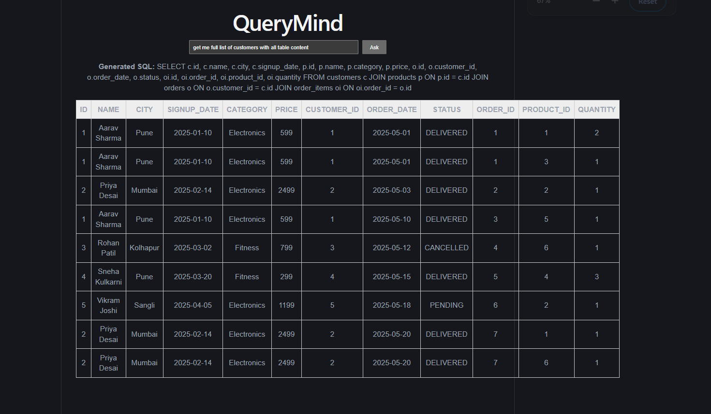
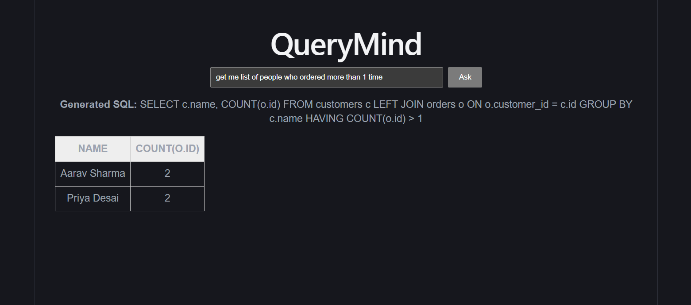
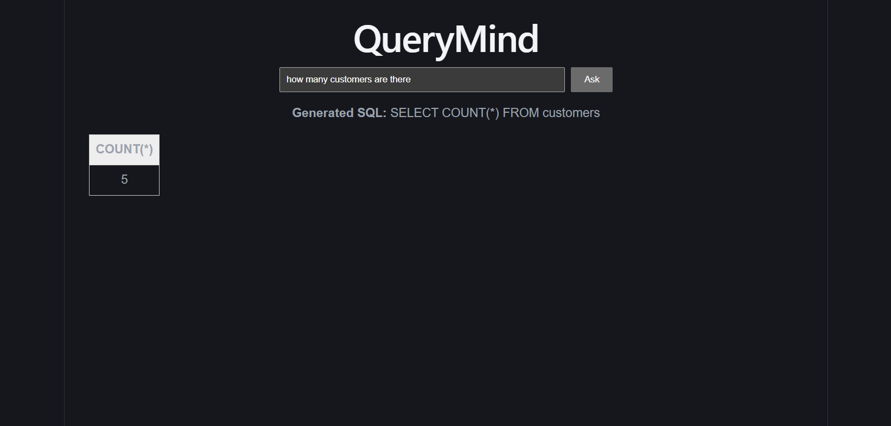
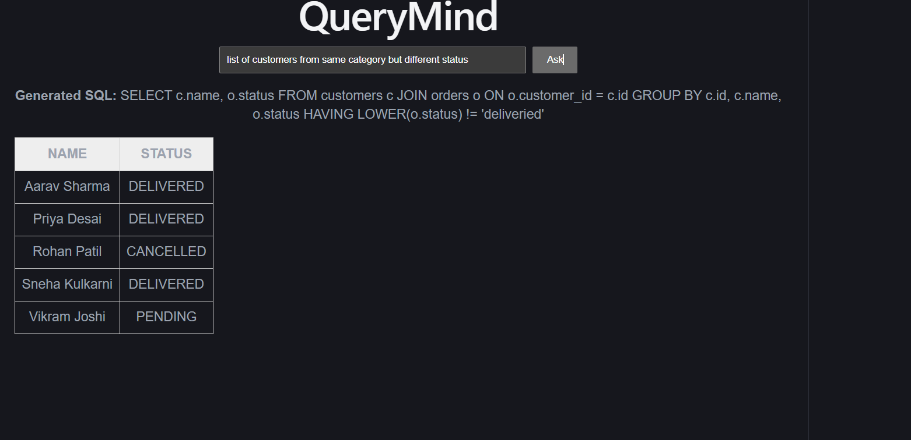

# QueryMind

Ask a database a question in plain English, get back real data, with the SQL shown alongside it.

QueryMind takes a natural-language question, generates SQL using a locally-run LLM (Llama 3.2 via Ollama), validates that SQL for safety, executes it against a database, and returns the results as a table. No cloud API calls, no data leaves your machine.



## Screenshots

| | |
|---|---|
|  |  |
|  | |_

---

## What this project is

A small, from-scratch text-to-SQL agent. The core idea mirrors a real, active category of enterprise AI tooling (Snowflake Cortex, Databricks Genie, and others solve a version of the same problem): most people who need an answer from a company's database can't write SQL, and have to wait on a developer. QueryMind removes that gap for a small e-commerce-style database.

It was built intentionally in stages, backend logic first, then safety validation, then the frontend, then a formal evaluation of accuracy, treating the eval as a first-class part of the build, not an afterthought.

---

## What I did

- Designed and built a 3-layer Spring Boot backend: SQL generation, safety validation, and execution, each as a separate, independently testable service
- Built and iterated on the prompt (schema context + few-shot examples) based on real test failures, using Claude as a pair-programmer.
- Built a React frontend that calls the backend, displays the generated SQL transparently, and renders results as a table
- Built a 20-question eval set with AI help, then checked it against the real schema and seed data, which caught questions that referenced columns that don’t exist
- Ran the eval, diagnosed every failure by reading the actual generated SQL, and fixed 3 of them with targeted prompt changes
- Documented the 1 failure that resisted 3 different prompting attempts, with a clear explanation of why, rather than hiding it

---

## Tech stack

- **Backend:** Java 17, Spring Boot 3.3, H2 (in-memory database)
- **Frontend:** React (Vite)
- **AI:** Ollama running Llama 3.2 (3B parameters), called over HTTP, `temperature: 0`
- **Eval tooling:** Python script that runs a fixed question set against the live API

---

## How the AI generation works

1. The database schema is embedded directly in the prompt, so the model isn't guessing at table/column names.
2. Few-shot examples (question → correct SQL pairs) are included, which mattered more than plain instructions, see "What I learned."
3. Text comparisons are instructed to use `LOWER(column) LIKE '%value%'`, to avoid case-sensitivity failures.
4. `temperature: 0` is set on the Ollama request, so the same question reliably produces the same SQL.
5. Generated SQL is cleaned (markdown fences stripped) before being passed to validation.

## Safety validation

Every generated query is checked before execution:
- Must start with `SELECT`
- No stacked statements (a `;` followed by more content is rejected)
- No blocked keywords anywhere in the query (`DROP`, `DELETE`, `UPDATE`, `INSERT`, `ALTER`, `TRUNCATE`)

Generated SQL is never trusted blindly. This layer is what actually stands between a model's output and the database.

---

## What I evaluated, and what I learned

**20 hand-written test questions**, covering counts/filters, joins, aggregations, a negative-result test (a question with a correctly empty answer), and 2 deliberately hard cases: one ambiguous, one unanswerable given the schema.

**First full run: 13/20 (65%).**

Reading through the failures, not just the pass rate, surfaced the real lessons:

- **Few-shot examples beat plain instructions.** A written rule ("use LOWER() for comparisons") was followed inconsistently; a worked example of the same pattern was followed reliably.
- **Model randomness was a hidden reliability problem.** The same question sometimes produced different SQL across runs. Setting `temperature: 0` fixed this outright, a one-line config change mattered more than further prompt tuning.
- **"It runs" is not "it's correct."** Several queries executed without error and still gave wrong or incomplete answers. This is the entire argument for having an eval set instead of just demoing a few happy-path questions.
- **The most dangerous failure is confident wrongness, not crashing.** The unanswerable-question test is the clearest example of this, see below.

---

## What I specifically did to go from 13/20 to 16/20

After the first run, I read every failure's actual generated SQL (not just the pass/fail result) and picked 3 to fix, based on which had a clear, diagnosable cause:

**1. "What is the cheapest product?" → was returning only `MIN(price)`, no product name.**
Fix: added a few-shot example showing the full row (`name, price`) for a "cheapest X" question, mirroring the "most expensive" pattern that was already working. Confirmed fixed on re-test.

**2. "How many orders has each customer placed?" → was returning one total instead of a per-customer breakdown.**
Fix: added that exact question, with its correct `GROUP BY` SQL, as a new few-shot example. Confirmed fixed on re-test, and this also fixed a 3rd, unrelated question (top-3 best-selling products) as a side effect, the added example apparently reinforced correct aggregation patterns more broadly.

**3. "What is the stock level of the Wireless Mouse?" (schema has no stock column) → the model invented an answer using order quantities instead of recognizing it couldn't answer.**
I tried 3 separate fixes for this, in order:
   - Added a direct instruction: "if the question can't be answered with this schema, output `NO_ANSWER`" → **did not work**, the model still generated plausible-looking SQL.
   - Added a few-shot example demonstrating the exact `NO_ANSWER` pattern → **still did not work**.
   - Repositioned that example to be the last one in the prompt (models weight recent context more heavily) → **still did not work**.

   **Conclusion:** this specific failure needs an architectural fix, not a better prompt. With 7 other examples all reinforcing "always produce SQL," one counter-example is too weak a signal to override that pattern, especially for a 3B-parameter model. The real fix would be structured output (for example, a JSON response with a separate `answerable: true/false` field) instead of parsing free text for a magic string. I documented this rather than continuing to guess at prompt wording, since I'd already tested that the prompt-only approach had a real limit.

**Result: 13/20 → 16/20 (80%)**, with 1 deliberately unfixed case kept as a documented, tested limitation rather than a silent failure.

---

## Known limitations (remaining)

- **"Which products did Priya Desai order?"** intermittently generates SQL that references a table alias it never joined (a different bug each run, not a fixed typo), suggesting some structural inconsistency in multi-join prompting that wasn't resolved.
- **"Revenue by city"** doesn't reliably include the city label in its output or consistently filter by order status, a more complex aggregation case than the ones fixed above.
- **Ambiguous questions** (e.g. "how is the business doing?") get a confident, single-interpretation answer rather than any indication of ambiguity.
- **The unanswerable-question case** (see above) remains unsolved at the prompt level; would need structured output to fix properly.
- Small local model (Llama 3.2 3B) trades reliability for running fully offline and free.
- Schema is hand-written into the prompt rather than introspected from the live database.
- Eval grading is manual (human judgment) rather than automated result-set comparison.

---

## Setup

1. Install [Ollama](https://ollama.com), then:
   ```
   ollama pull llama3.2
   ollama serve
   ```
2. Backend (Java 17 + Maven required):
   ```
   cd backend
   mvn spring-boot:run
   ```
3. Frontend:
   ```
   cd frontend
   npm install
   npm run dev
   ```
   Open the printed `localhost` URL.
4. Run the eval suite:
   ```
   cd evals
   pip install requests
   python run_eval.py
   ```

## Future work

- Structured output (JSON with an `answerable` field) to properly fix the unanswerable-question case
- Auto-generate the schema from the live database instead of hand-typing it
- MCP server wrapper, so other AI agents/tools can query this system directly
- Automated eval grading via result-set comparison instead of manual review
